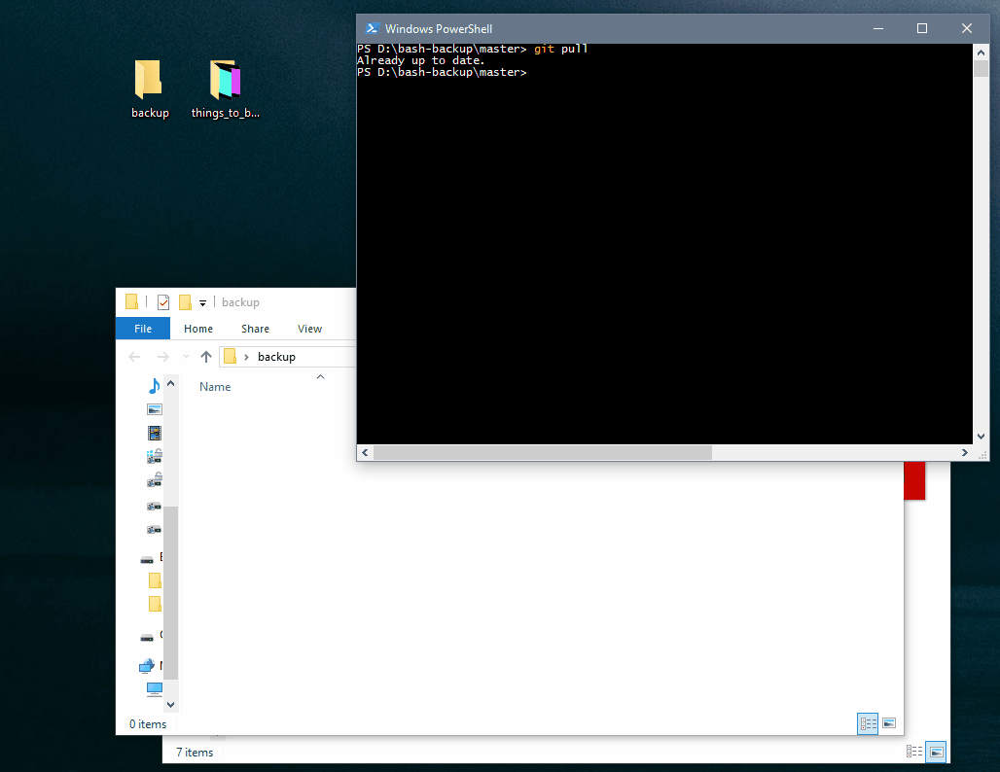

# BASH-backup

A collection of open source backup tools brought together to help users backup
from one location to another and keep snapshots of their data for a specified
duration.

## Getting Started

You must first install Docker on your workstation before continuing. Download
and install the `Docker CE` (community edition) from https://www.docker.com then
follow the Docker installation process for you workstation environment (Linux,
Winodws or Mac OSx).

Once Docker is running on your machine you can edit the `./run.WHATEVER.sh` and
change the three variables at the top of the file.

* install_path
* files_to_backup
* backup_location

**Please note** - if you're backing up from or to an external USB drive you
may need to edit the Docker settings to grant permission to these drives.

### Mac OSx users

You can easily create a desktop icon to click on by running the following in
terminal.

```
sudo ln -s ~/bash-backup/run.mac.sh ~/Desktop/BASH-backup.sh
```

## Performing a backup

In the root of the repository you'll find a BASH (or PowerShell) script for your
environment, edit the top of this file and run it.

In Linux and Mac OSx you can use CRON to schedule this or if using Windows you
could use Scheduler.

Once the backup is complete review the contents of your `$backup_location` -
you will find two directories:

* ./latest - this is a mirror/clone of your source directory
* ./snapshot - this is a snapshot of your latest directory, if you delete a file it will remain in here for 365 days by default

If you change the backup source path (`$files_to_backup`) then then contents of
`$backup_location` will be emptied and replaced with a new copy of
`$files_to_backup`... However previously backed up files will remain in the
snapshots directory in `$backup_location`.

### Changing default file retention

You can change the default **365 days** to retain backups by modifing the `./src/rsnapshot.conf`

## Encryption

Firstly we must create a GPG key, in Linux you can run the following after
installing `apt-get install gnupg2`:

```
gpg2 --gen-key
```

This will output a file called...

FIXME

## Built With

* [Docker](https://www.docker.com/) - The app framework used
* [rsync](https://rsync.samba.org/documentation.html) - Used to mirror files
* [rsnapshot](http://rsnapshot.org/) - Used to generate snapshots

## Contributing

Please read [CONTRIBUTING.md](https://github.com/harrywebster/bash-backup/blob/master/CONTRIBUTING.md)
for details on our code of conduct, and the process for submitting pull requests
to us.

## Example



## Authors

* **Harry Webster**

See also the list of [contributors](https://github.com/harrywebster/bash-backup) who participated in this project.

## License

This project is licensed under the MIT License.

## Acknowledgments

* Mr J Seal for requesting this facility from me... it's a handy little tool for me too, i hope others get some use also.
